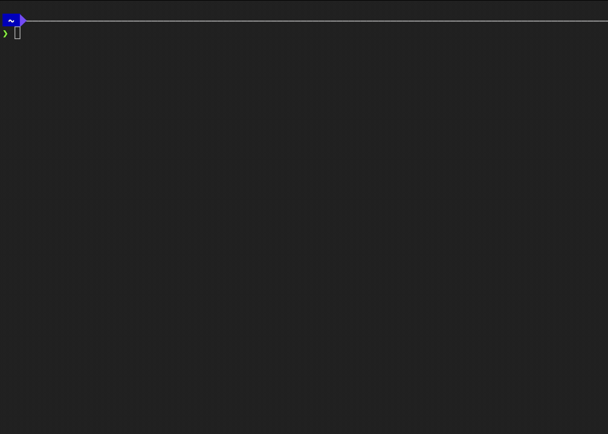

<h1 align="center">
  Remarking
</h1>

<div align="center">
  <a href="https://github.com/sabidib/remarking/issues/new?assignees=&labels=bug&template=01_BUG_REPORT.md&title=bug%3A+">Report a Bug</a>
  ·
  <a href="https://github.com/sabidib/remarking/issues/new?assignees=&labels=enhancement&template=02_FEATURE_REQUEST.md&title=feat%3A+">Request a Feature</a>
  .
  <a href="https://github.com/sabidib/remarking/issues/new?assignees=&labels=question&template=04_SUPPORT_QUESTION.md&title=support%3A+">Ask a Question</a>
</div>

<div align="center">
<br />

[](LICENSE)
[](https://github.com/sabidib/remarking/issues?q=is%3Aissue+is%3Aopen+label%3A%22help+wanted%22)
[](https://github.com/sabidib)
[](http://ansicolortags.readthedocs.io/?badge=latest)


</div>


## About

Remarking is a command line tool for extracting highlights from documents on your reMarkable tablet.

Remarking makes it as easy as possible to extract highlights from your annotated documents.





Remarking serves to be the first part of a highlight extraction pipeline.

This means, you can use Remarking to extract your highlights for then futher processing such as:
  - Sending it to a service 
  - Combining it with another collection of highlights
  - Further filtering of highlights with more tooling

I found that there was no easy way of extracting highlights from the reMarkable. There were quite a few 
tools that focussed solely on extracting the highlights from the downloaded pdfs. However, nothing made
the process as easy as specifiying the folder to scan for documents.


## Installation

### Requirements

You will need at least:
  - Python 3.7+
  - Pip


### Install
To get started you can install the package from pip with:
```
pip3 install remarking
```

The `remarking` command should then be available for you to use.


## Usage

Check out the [docs](https://remarking.readthedocs.io/en/latest/) for help, or run `remarking --help`.


### Token

Before you start you will need to grab a one-time authorization key from [https://my.remarkable.com/device/connect/desktop](https://my.remarkable.com/device/connect/desktop). This code is used to access the reMarkable cloud.

[rmapy](https://github.com/subutux/rmapy) is used to access the reMarkable Cloud. After authorizing the first time, the tool will store an auth
token in `~/.rmapi` for future use. You won't need to re-authorize by providing the token again until you deauthorize
the key.

You can specify the token through the `REMARKING_TOKEN` env var in addition to via command line with `--token`.

### Modes

There are two main modes of usage of Remarking: run and persist.

#### run

`remarking run` will run the default extractors on all passed documents and folders. Highlights extracted
are then output using the writer subcommand passed.

```
remarking run json books
```

This command will run the default extractors on all documents in the books folder and output the highlights as json.

#### persist

`remarking persist` performs the same extraction on documents as run, however it maintains state
of previously seen documents and highlights.

By default it creates a `remarking_database.sqlite3` database file in the current working directory that keeps track of
seen highlights and documents.

You can also use your own database by providing the `--sqlalchemy` argument with a sqlalchemy connection string.

```
remarking persist json books
```

This command will run the default extractors on all documents in the books folder and output the highlights as json.

All documents and their highlights found would also be added to the sqlite3 database `remarking_database.sqlite3`.

A second run would return no new highlights if the documents in the books folder are not modified.

## Examples

You can check out some examples in [the examples section of the docs](https://remarking.readthedocs.io/en/latest/examples.html).

## Roadmap

See the [open issues](https://github.com/sabidib/remarking/issues) for a list of proposed features (and known issues).

## Built With

  - Python 3
  - [rmapy](https://github.com/subutux/rmapy)
  - [click](https://click.palletsprojects.com/en/8.0.x/)
  - [sqlalchemy](https://www.sqlalchemy.org/)

## Support

Reach out to the maintainer at one of the following places:


- [GitHub issues](https://github.com/sabidib/remarking/issues/new?assignees=&labels=question&template=04_SUPPORT_QUESTION.md&title=support%3A+)
- The email which is located [in this GitHub profile](https://github.com/sabidib)


## Contributing

First off, thanks for taking the time to contribute! Contributions are what make the open-source community such an amazing place to learn, inspire, and create. Any contributions you make will benefit everybody else and are **greatly appreciated**.

We have set up a separate document containing our [contribution guidelines](CONTRIBUTING.md).

Thank you for being involved!

## Authors & contributors

The original setup of this repository is by [Samy Abidib](https://github.com/sabidib).

For a full list of all authors and contributors, check [the contributor's page](https://github.com/sabidib/remarking/contributors).

## Security

Remarking follows good practices of security, but 100% security can't be granted in software.
Remarking is provided **"as is"** without any **warranty**. Use at your own risk.

_For more info, please refer to [security](SECURITY.md)._

## License

This project is licensed under the **GPL v3** license.

See [LICENSE](LICENSE) for more information.

## Acknowledgements

* [rmapy](https://github.com/subutux/rmapy)
* [remarks](https://github.com/lucasrla/remarks)
* [biff](https://github.com/soulisalmed/biff)
* [sqlalchemy](https://www.sqlalchemy.org/)
* [The unofficial reMarkable discord](https://discord.gg/u3P9sDW)

